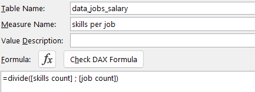
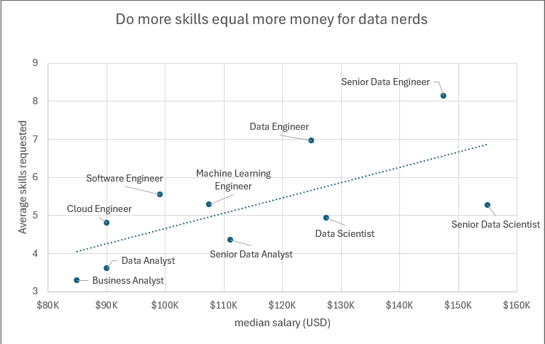

# My Excel Data Analytics Project
## Salary Dashboard    
This project is from the 'Excel for Data Analytics' course by Luke Barousse. It visualises the median salaries for jobs in the data science field. The point is to provide job seekers with insights on how differents data science roles are compensated across different countries and with different schedule types.  
The link of the file is [here](Project1_Salary_Dashboard/Project1_Salary_Dashboard.xlsx).

  
### Excel Skills used
- Formulas and functions
- Data Validation
- Charts
### Data Jobs Dataset 
The dataset in this project contains real-world data information from 2023 of the data science job including details about:
- Job titles
- Countries
- Locations
- Yearly Salaries
- Schedule Types
### Dashboard Build
#### Formulas and Functions  
##### Median salaries by job title  
   

This formula reflects:  
-  Multi criteria filtering : where we filter Yearly salaries based on specific job title, country, and schedule type while excluding blank salaries.
-  It applies the MEDIAN function with a conditional IF to analyze the array by presenting the conditions related to calculating the median salary.
-  The returning value of this formula is to populate the table below, representing the median salary by job title, country, and schedule type.
  
  
  ### Charts
  #### Clustered bar chart
    

  - This bar chart utilizes the previous table of median salaries to visualize the  median salaries of different jobs in the data science field.
  - Horizontal bars are suitable for ranking comparisons.
  - Only two colors to distinguish between the selected job title and the others jobs.
  - Data orgnizations: The jobs are sorted in a descending order for an enhanced clarity and comparison.
  - Provides an identification on salary trends as it shows that senior roles and engineers are generally higher paid than analyst roles.
 #### Map chart

- Color coded map that shows salary distribution by country, with darker color representing higher slaries , light colors representing low ones.
- Plotted data when selecting different countries on the map.
- Gives highlights on low\high salary countries.

  ### Data Validation
  
Filtered Lists are used for Job titles , country , and schedule type job.
 - Preventing invalid entries by only allowing selction from the predefined list.
 - Facilitating data entry
 -  Making the dashboard more usable by enhancing and cleaning its overall structure.

 
## Salary Analysis

This part linked in the file [here](Project2_Analysis.xlsx) is about analyzing the data science job market while answering the following questions related to salaries and in-demand skills:

1-Do more skills lead to better salaries?

2-What are the top skills of data professionals?

3-What is the salary for data roles in different regions?

4-What is the pay for the top 10 skills in data?

### Excel Tools

For this, various Excel tools were used to clean, transform, and analyze the data which are the following:

- ⚙️Power Query (ETL)

- 📊Power Pivot

- 🧮DAX (Data Analysis Expressions)

- 📈Pivot tables & Pivot Charts 

### Data Jobs Dataset 
The dataset in this project contains real-world data information from 2023 of the data science job including details about:
- Job Titles
- Locations
- Salaries
- Skills

1️⃣ Do more skills lead to better salaries?

#### Skills: ⚙️Power query & DAX

 ○ First i extracted the  original dataset (data_salary_all.xlsx) and created two queries such as :
 - data_jobs_salary that has all the fields of the jobs information
 - second one is data_job_skills that has all skills per job_id
   
 ○ I performed a cleaning on both queries, this step included:
    ● trimming whitespace
    
    ● reording columns
    
    ● replacing values
    
    ● changing types 
    
    ● unpivoting columns
    
    The applied steps are indicated in the screenshot below:

○ The next step is to load both of them into the workbook for further analysis

○ I put the job title in rows then perform some DAX measures to support the analysis. We need the median salary : 

○  We also need the job count and skills count to be able to calculate the skills per job values for each job title.

#### 📊 Analysis

🔎 As we can see there is a postive correlation between the median salary and the number of skills required per job which suggest that roles that require a broader set of skills tend to offer higher salaries.

🔎 we also notice that data engineer roles require more skills than the other data roles while they dont always pay better.

⭐ key insight:

   jobs that require fewer skills, tend to offer lower salaries, indicating that skill diversity may lead to better compensations.

   This trend highlights the importance of aquiring multiple skills in the data field, especially for professionals who aim for high salaries.
   
2️⃣ What are the top skills of data professionals?

#### Skill: 📊 Power Pivot

○ I created a Data model using the tables data_jobs_salary and data_jobs_skill that were already cleaned in power query
○  I created a relationship between the two tables using the job_id column 
 

○ the power pivot menu allows the refining of data and the creation of measures
 

#### 📊 Analysis
 

🔎as we can see from the top 10 skills sorted from largest to smallest, SQL is the skill with the most commonly required skill, highlighting the fact that database management is fundemental in almost every data role

🔎data roles are also increasingly requiring Python with its ML and AI Tools as well as cloud and big data tools

⭐ key insight:
   Most data roles require SQL and python as they represent a core fundemental for processing and analysis. 

3️⃣ What is the salary for data roles in different regions?
#### Skills : 🧮 DAX & 📈 Pivot tables 
○ I loaded the previous data model into a pivot table, i put the job_title field in rows and median salaries in values, those median salaries are: 

  ● The median salary for all data roles calculated previously
  ● The median salary of data roles in job pstings occuring only in the US and calculated using DAX as follows 
  

  ● The median salaries of all countries except the US:

○ A slicer was added to enable dynamic filtering, allowing users to view median salaries for specific countries.

#### 📊 Analysis

🔎 The table provides an overview for both professionals and recruiters, giving them an idea of how different data roles are compensated across various regions.
🔎 Regardless of the region, senior data engineers and senior data scientists tend to earn higher salaries than the other roles suggesting that advanced expertise is high demanded in the data field. 
🔎 Us median salaries are relatively higher than non us median salaries, suggesting that the US is a major center for tech companies with strong demand for different data roles.

⭐ key insight:
   Salaries are influenced by both data roles and geographic region.

 4️⃣ What is the pay for the top 10 skills in data?

#### Skill: 📈Pivot Charts & 🧮 DAX

○ I created a pivot table where job_skills in the axis, and median salary and job count are in the values 
○ Since the median salary is calculated from the data_jobs_salary table, DAX is used for crossfiltering to enable bidirectionnal filtering so that the median salary can be calculated for each skill. 

○ A combo chart is then inserted with median slaries represented as a clusterd column and job count as a marker. 

#### 📊 Analysis

 
   

