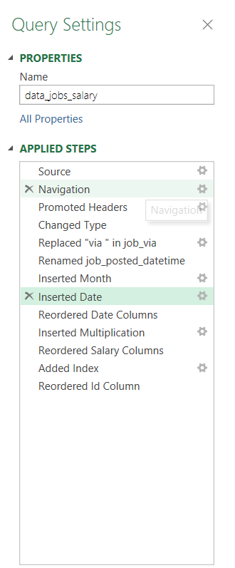
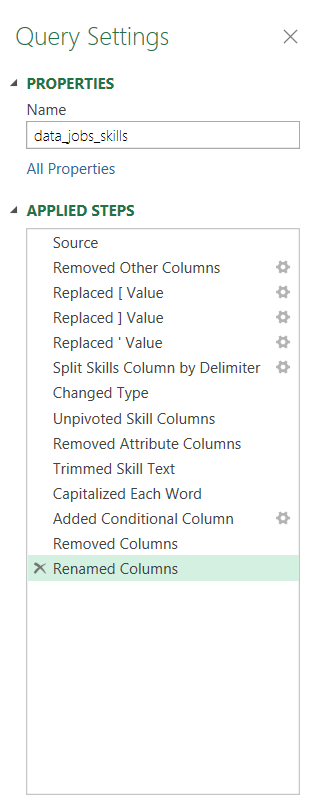
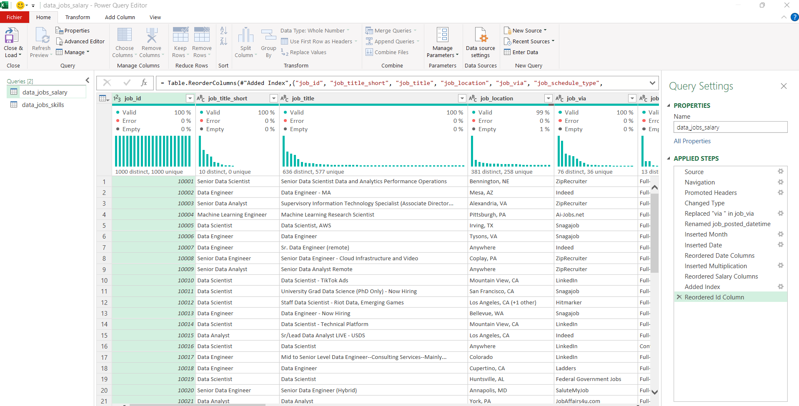

# My Excel Data Analytics Project
## Salary Dashboard    
This project is from the 'Excel for Data Analytics' course by Luke Barousse. It visualises the median salaries for jobs in the data science field. The point is to provide job seekers with insights on how differents data science roles are compensated across different countries and with different schedule types.  
The link of the file is [here](Project1_Salary_Dashboard/Project1_Salary_Dashboard.xlsx).

  
### Excel Skills used
- Formulas and functions
- Data Validation
- Charts
### Data Jobs Dataset 
The dataset in this project contains real-world data information from 2023 of the data science job including details about:
- Job titles
- Countries
- Locations
- Yearly Salaries
- Schedule Types
### Dashboard Build
#### Formulas and Functions  
##### Median salaries by job title  
   

This formula reflects:  
-  Multi criteria filtering : where we filter Yearly salaries based on specific job title, country, and schedule type while excluding blank salaries.
-  It applies the MEDIAN function with a conditional IF to analyze the array by presenting the conditions related to calculating the median salary.
-  The returning value of this formula is to populate the table below, representing the median salary by job title, country, and schedule type.
  
  
  ### Charts
  #### Clustered bar chart
    

  - This bar chart utilizes the previous table of median salaries to visualize the  median salaries of different jobs in the data science field.
  - Horizontal bars are suitable for ranking comparisons.
  - Only two colors to distinguish between the selected job title and the others jobs.
  - Data orgnizations: The jobs are sorted in a descending order for an enhanced clarity and comparison.
  - Provides an identification on salary trends as it shows that senior roles and engineers are generally higher paid than analyst roles.
 #### Map chart

- Color coded map that shows salary distribution by country, with darker color representing higher slaries , light colors representing low ones.
- Plotted data when selecting different countries on the map.
- Gives highlights on low\high salary countries.

  ### Data Validation
  
Filtered Lists are used for Job titles , country , and schedule type job.
 - Preventing invalid entries by only allowing selction from the predefined list.
 - Fcailitating data entry
 -  Making the dashboard more usable by enhancing and cleaning its overall structure.

 
## Salary Analysis

This part linked in the file [here](Project2_Analysis.xlsx) is about analyzing the data science job market while answering the following questions related to salaries and in-demand skills:

1-Do more skills lead to better salaries?

2-What is the pay for the top 10 skills in data?

3-What are the top skills of data professionals?

4-What are the salaries in different regions?

### Excel Tools

For this, various Excel tools were used to clean, transform, and analyze the data which are the following:

- ⚙️Power Query (ETL)

- 📊Power Pivot

- 🧮DAX (Data Analysis Expressions)

- 📈Pivot tables & Pivot Charts 

### Data Jobs Dataset 
The dataset in this project contains real-world data information from 2023 of the data science job including details about:
- Job Titles
- Locations
- Salaries
- Skills

1️⃣ Do more skills lead to better salaries?

Skill: ⚙️Power query

 ○ First i extracted the  original dataset (data_salary_all.xlsx) and created two queries such as :
 - data_jobs_salary that has all the fields of the jobs information
 - second one is data_job_skills that has all skills per job_id
   
 ○ I performed a cleaning on both queries, this step includes trimming whitespace, reording columns , replacing values, changing types and unpivoting columns. The applied steps are indicated in the screenshot below:

○ The next step is to load both of them into the workbook for further analysis

